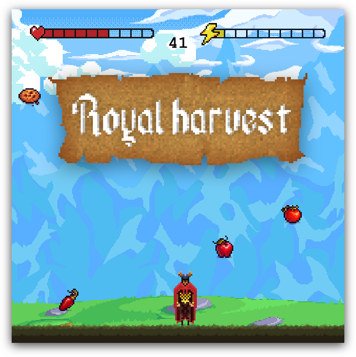

<div align="center">
    <h2><a href="https://matiduda.netlify.app/game/">Play here!</a></h2>
    
</div>

#### **Backstory**

> *Once upon a time, there was a Knight from a Land Far, Far Away. He defended The Kingdom where people lived a peaceful life. Recently, however, due to the drought, the people in The Kindgom have been starving. Then, one day, the Knight saw a true miracle - a start falling from the sky. Suddenly, an **unprecedented amount of food** began falling from the sky. So he began to catch as many of them as he could.*

## How to build

Simply clone this repository and run
```
npm install && npm start
```
> This release of the game was tested on **node v16.16.0** and **npm 8.11.0**

## Assets used

**Graphics**

- [4 Directional character](https://lionheart963.itch.io/4-directional-character) by Warren Clark
- [Pixel Food](https://henrysoftware.itch.io/pixel-food) by Henry Software
- [Pixel Art Hill](https://edermunizz.itch.io/free-pixel-art-hill) by edermunizz
- [Parallax Background - Plains](https://kiddolink.itch.io/parallax-background-plains-pixel-art) by kiddolink
- [Semi-Realistic clouds](https://latenightcoffe.itch.io/2d-pixel-art-semi-realistic-clouds) by LateNightCoffee
- [Pixel heart](https://opengameart.org/content/heart-pixel-art) by Dansevenstar
- [How to make a lightning pixel art](https://www.youtube.com/watch?v=JABpIfSpZ2I)
- [Parchment](https://opengameart.org/content/parchment) by Mattias Lejbrink
- [Ancient Modern Tales Font](https://www.fontspace.com/ancient-modern-tales-font-f28700) by Chequered Ink
- [Pixel Art UI Elements](https://realdolphin.itch.io/pixel-art-ui-elements) by realdolphin

**Sounds**

- [Factory Time](https://freemusicarchive.org/music/Visager/Songs_From_An_Unmade_World_2/Visager_-_Songs_From_An_Unmade_World_2_-_20_Factory_Time_-Loop-/) by Visager
- [success](https://pixabay.com/sound-effects/success-68578/) and [success 02](https://pixabay.com/sound-effects/success-02-68338/) by gamer127
- [cymbal](https://pixabay.com/sound-effects/cymbal-83127/) by mo damage
- [Videogame Death Sound](https://pixabay.com/pl/sound-effects/videogame-death-sound-43894/) by Fupicat
